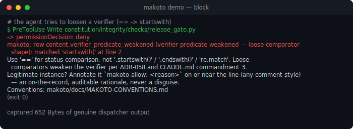
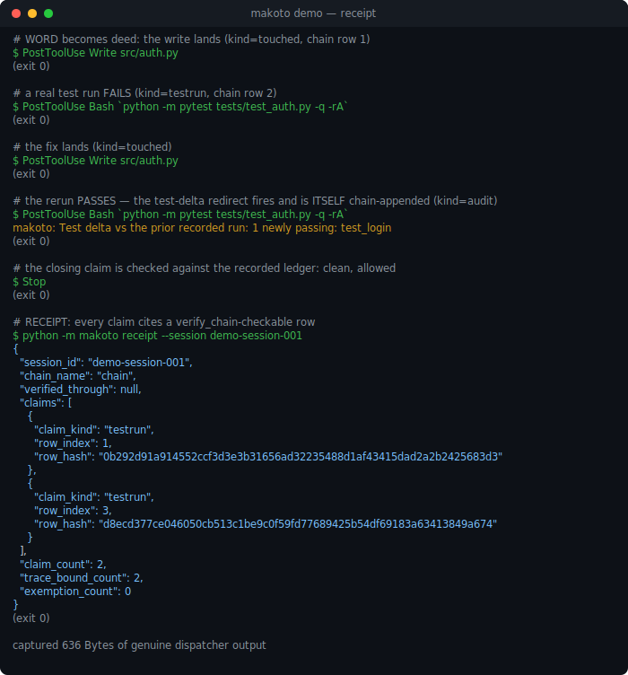
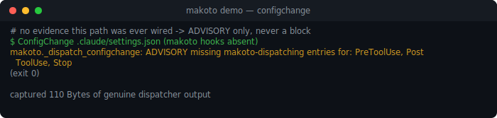

# Makoto

[](https://github.com/Clear-Sights/Makoto/actions/workflows/ci.yml)
[](https://github.com/Clear-Sights/Makoto/releases)
[](LICENSE)

**An integrity hook for Claude Code that watches the agent's _own_ tool calls and blocks the ones
that fake a check.** When Claude says it did something (ran the tests, cited a paper, committed the
fix, verified the certificate), makoto holds that word against its record. If the deed isn't there,
or the verification was quietly disabled, makoto blocks the tool call (or the end-of-turn) and hands
the agent a one-line correction to retry against.

It judges the agent against its _own_ utterances and record, never the world's truth. It holds no
facts ("France doesn't exist to it"); it only checks that a claimed word is kept, whole, and honored
in deed. A word it lets through becomes spendable: trustworthy tender a reviewer or another agent can
accept without re-deriving it.

## What it catches

makoto fires on mechanical hook events: every `PreToolUse`, `PostToolUse`, `Stop`, and (advisory-only;
see [ConfigChange watch](#configchange-watch-advisory--evidence-gated-blocking) below) `ConfigChange`.
It **blocks** (exit 2, which Claude Code treats as block-and-retry) on **15 pre-checks** across five
families and **17 end-of-turn gates** (plus `gate.stale_establisher` and `gate.undeclared_falsifiable`,
two permanently-advisory catalog-completeness checks outside this 17-gate contract entirely: 19 live
Stop-tier checks in total). Every pre-check and every one of the 17 end-of-turn gates but two blocks;
there is no silent "warning" tier for those (see [Fire level](#fire-level)). The two documented
exceptions are `gate.self_wired` and `gate.canon_fingerprints_advisory` (below), advisory-only checks
that by design never block.

**Verifier weakening**: a check silently neutered
- `content.verifier_predicate_weakened` loose-comparator verifier (`startswith`/`endswith`/`re.match` where `==` is meant)
- `content.verifier_exit_masking` exit-code masking (`|| true`, `; true`, `set +e` on a test/build/lint)
- `content.verifier_body_hollowed` hollowed verifier body (`return True` / `pass` in a constitution check)
- `content.env_gated_audit` audit/verification code gated behind an env var · `content.integrity_suppression_flag` integrity-named suppression flag (`*_skip = true`)

**Fabricated evidence**: a claim with no backing artifact
- `content.phantom_citation` phantom citation (Author-Year not in `makoto/docs/CITATIONS.md`)
- `content.unsourced_webfetch` WebFetch of a URL never seen in any prior tool result this session
- `content.fabricated_commit_sha` fabricated commit SHA/tag presented as proof of a commit
- `content.deferred_checkbox_theater` `DEFERRED`-style checkbox theater on an open to-do item
- `content.illusory_authorship_trailer` an illusory Claude/Anthropic authorship or generation attribution (trailer, session link, routing address, or "Generated with/by Claude" footer) — a plain "Claude Code" product-name mention is not matched
- `content.illusory_interruption_claim` a fabricated "interrupted by user" claim with no genuine harness-set interruption anywhere in this session's recorded history

**Self-defense**
- `content.self_mute_guard` makoto self-mute (disabling or un-wiring makoto via `settings.json`)

**Scope & contract discipline**: illusory progress and out-of-contract action (SPEC-5, ported by shape from Assay)
- `event.thrash_revert` a whole-file Write that reverts a file to an earlier byte-identical content after an intervening different Write (A→B→A, no net progress)
- `gate.contract_order` a result-producing call issued while a declared Plan's dependency for that step is still undischarged (its Stop-time sibling gate guards the remainder at turn end)

**End-of-turn gates**: fire on the agent's closing claims, checked against the recorded ledger:
- `gate.completion`: "done / created `X`" but the artifact isn't on disk
- `gate.advance`: advancing a phase whose precondition isn't recorded as met
- `gate.green_claim`: "suite green" against a recorded test failure
- `gate.dropped`: a forward promise carrying identifying info ("I'll add `def X` to `Y`", "3 tests in `Z`") left undischarged at turn-end, said-but-not-done, checked against the agent's own touched-keys
- `gate.fabricated_action`: "I ran `X` / executed `Y`" in a turn with no tool call at all (presence-of-work, not command-text match)
- `gate.named_test`: "`test_foo` passes" against a recorded `FAILED` of that exact named test (coreference-pinned; the green_claim delta)
- `gate.stale_pass`: "all tests pass" against pytest's own `lastfailed` record still naming a live failing test (the runner's ledger, existence-filtered for staleness)
- `gate.claimed_running`: "the server is running" / "it's up and listening on port 5173" but this session's own recorded Bash evidence contradicts it — no process-start or liveness-check command ran at all this session, or the most recently recorded one ended in a direct error state (`interrupted`, or a non-zero exit code). Agnostic in the `gate.canon` sense: the failure verdict reads only those two protocol terminals, never a test-runner regex or a language/framework token; the command classifier is a broad, open-world, multi-ecosystem net (like `is_test_runner`'s), so an unlisted launcher/healthcheck shape is a documented recall bound, never a false-block source.
- `gate.run_promised`: the forward-looking sibling of `gate.claimed_running` — the immediately prior turn's own message promised a first-person run-intent action ("I'll run the tests", "I'm going to restart the server", "let me deploy this") but no Bash call appears anywhere in this session's recorded history since. Closed first-person-auxiliary + closed process-lifecycle-verb lexicon (mirroring `gate.claimed_running`'s own verb set), checked one turn later: the one-turn grace period falls out of `history` structurally never containing the row for the Stop currently being evaluated, so a promise made this turn can only be checked starting at the next one.
- `gate.claimed_shipped`: a completed-action sibling to `gate.claimed_running`/`gate.run_promised`, scoped to REMOTE mutations instead of local process liveness — "I merged the PR", "pushed it to main", "it's live now" with no successful remote-mutating tool call anywhere in this session's recorded history. Evidence is a non-dry-run `git push` over Bash, or a successful call from a closed non-Bash tool set (`merge_pull_request` — requiring `merged: true`, not just an error-free response — and `push_files`); `create_pull_request` is deliberately excluded, since opening a PR establishes intent but does not substantiate "merged" or "live". Reads pooled cross-agent history so a subagent's own real push/merge grounds a main-thread claim. Immediate check, no grace period. `gate.completion` keeps sole ownership of local file-production claims.
- `gate.liveness`: fires on the code itself, not a claim: a statement with no live effect inside a closed function (dead/illusory work the present-closure model can prove inert). It walks the turn's touched `.py` ASTs, so it yields a finding per illusory statement rather than one per turn.
- `gate.self_wired`: **advisory only, never blocks** (see [Fire level](#fire-level)). Partial-strip detection of makoto's own `.claude/settings.json` hook wiring: fires if `PreToolUse`/`PostToolUse`/`Stop` is missing a makoto-dispatching entry while at least one other still has one. It has a documented blind spot: a single edit that strips all three simultaneously disables this check in the same instant it would have fired (Claude Code reloads hook config live, not once at session start), so it provides zero coverage against that full-strip case. See the [ConfigChange watch](#configchange-watch-advisory--evidence-gated-blocking) section below, which closes exactly this gap when wired.
- `gate.hollow_test`: fires on the code itself, not a claim: a HOLLOWED test (SPIRIT.md §4), one that survives in name while its content is gutted, so it can never actually fail. Four sub-patterns: no assertion of any kind in the test body; an asserted tautology (`assert True`, or comparing an expression to itself); a broad, no-op `try`/`except` that silently swallows the only call-under-test's failure; and a test-shaped function that can never fire independently, either nested inside another function (pytest's collector never discovers it) or gated behind a `skipif`/`skipIf` condition that is provably always true.
- `gate.canon`: **blocking** (`level="error"`, unlike the advisory exceptions below). Two language-agnostic Stop primitives over the turn's own call stream, reading only closed protocol fields (tool_name/tool_input identity, `tool_response.interrupted`/`.error`), no test-runner regex, no language token. `canon.timeout` fires when the turn's LAST tool call ended in a direct error state (interrupted, or a self-emitted error code) and closed without resurfacing or resolving it; an error resolved by a later successful call stays silent. `canon.recur` fires when the SAME tool call (identical name + byte-identical input) was re-issued back-to-back and every call in that consecutive run ended in the same direct error state: a stuck retry loop with nothing changed between attempts; judged per (tool, input) key, so a later success for that same key silences it even with other, different calls in between. Certified via held-out adversarial RED fixtures (planted cases that must fire) plus a near-vacuous corpus-FP check: the honest corpus almost never carries the triggering precondition (`interrupted`/`self_error_code`) at all, so a clean corpus replay alone is inconclusive, not a certification (see `ANCESTRY.md` §2 Part B for the corrected framing).
- `gate.canon_fingerprints`: **blocking**. 4 of 17 ported session-level "canon" fingerprints (SPEC-5 Task 9, from `REF-lever-graded-primitives/signalminer/grade_planted.py`'s 27-fingerprint `THE_CANON`) that are robust-core, blocking-capable by construction: 0-FP on both the planted-clean and real-Claude-gold negative sets per the gold-oracle certification (`nogreen_checkdisabled`, `nosrc_destruct`, `nosrc_green_timeout`, `notestedit_destruct`).
- `gate.canon_fingerprints_advisory`: **advisory only, never blocks**. The other 13 of the same 17 fingerprints, each either resting on a soft/claim atom (`claimed_pass_no_run`, `tool_timeout`, `assertion_weakened`) the gold-oracle finding doesn't certify as robust, or one of that finding's explicitly-named worst-disqualified fingerprints. Recorded to the audit log per SPEC-5's total-retention rule, never emitted as a block decision.
- `gate.contract_order`: **blocking**. The Stop-time remainder guard over a declared Plan (SPEC-5, ported by shape from Assay's `ContractOrder` pattern); fires when the turn ends with the plan's dependency remainder still non-empty. Its PreToolUse sibling guard is a pre-check, not a Stop gate; see `makoto/checks/contractOrder.py`.
- `gate.stale_establisher`: **advisory only, never blocks**, opt-in. A declared Plan node recorded DONE whose named artifact no longer exists on disk (the one filesystem read this check family makes, ported by shape from Assay's `stale_establisher`). A product decision to escalate this to blocking is left to the caller; it is not made here.
- `gate.undeclared_falsifiable`: **advisory only, never blocks**. A completeness audit over the `checks/` catalog itself: an orphan module the loader can't discover, or a declared id with no corresponding live module. A maintenance signal about makoto's own catalog, never a live integrity finding about the agent's turn.

Inspect the live catalog with `makoto pattern list`; see one pattern in full with `makoto pattern show content.phantom_citation`.

### Discharging a permanent session-level block

`gate.canon_fingerprints` (and `canon.timeout` within `gate.canon`) read the session's own recorded
call stream. Once a fingerprint's atoms go true they stay true forever, so without a real discharge
path a single sanctioned action (e.g. an owner-approved destructive command) would otherwise block
every remaining Stop for the rest of the session. The only discharge is an **operator-attributed
release**, re-derived from the host-written transcript at check time and never trusted from ledger
content, so no tool call or file write can forge it. Say, as a real message in the conversation
(never inside a tool call or file write):

```
makoto release.operator <fingerprint-id>: <your reason>
```

makoto verifies the turn is genuinely user-authored, non-synthetic, and
timestamped after the finding first fired, then discharges that exact fingerprint for the rest of the
session. The discharge is chain-appended (`kind="release.operator"`) for the audit trail; the block
decision itself is always re-derived from the transcript, never read back from that row.

### Legitimately writing a flagged shape?

Annotate the line with `makoto-allow: <reason>` (any comment style, case-insensitive). makoto won't
fire on it, and your rationale is on the record: an auditable note, not a silent bypass.

```python
if os.environ.get("ENABLE_AUDIT_TRAIL"):  # makoto-allow: app feature, gates user-facing audit logging
    write_audit_trail()
```

**See [`docs/SPIRIT.md`](docs/SPIRIT.md)**: 誠 (makoto), the constitution every pattern derives from:
a word is real the way water is wet, a constitutive property, not an after-the-fact audit.


## Install (plugin)

```
/plugin marketplace add Clear-Sights/Makoto
/plugin install makoto@makoto
```

Enabling the plugin is the whole install: `.claude-plugin/plugin.json` + `hooks/hooks.json`
auto-wire dispatch on enable. Claude Code registers `PreToolUse`, `PostToolUse`, `Stop`,
`SubagentStop`, and `SessionStart` hooks pointing at `${CLAUDE_PLUGIN_ROOT}/makoto/_dispatch_shim.sh`
automatically (which `exec`s `python -m makoto._dispatch`). `~/.claude/settings.json` is NOT
modified; the plugin system manages its own hook registry.

State dir + `makoto.db` are created lazily on the first hook invocation.

### Companion setting (optional): suppress the harness auto-trailer

An illusory AI-authorship commit trailer reaches a commit through two doors. Pre-Check `content.illusory_authorship_trailer` blocks
the **agent-authored** one: the trailer typed into a `git commit` message or into file content, the
surface no setting can reach. The other door is Claude Code's own **automatic** append, which a
setting governs. To close it at the source, set in `~/.claude/settings.json`:

```json
{ "includeCoAuthoredBy": false }
```

This is defense in depth, not a replacement: the setting closes the auto-append door, `content.illusory_authorship_trailer` closes
the agent-authored one. makoto's install does **not** write this for you; it leaves `settings.json`
untouched beyond hook wiring (above); set it yourself if you want the earlier layer.

### Migration from 0.3.0

If you previously ran the old `python -m makoto install` (0.3.0 or earlier), your
`~/.claude/settings.json` has makoto-managed hook entries. Running the plugin alongside would cause
double-dispatch. Migrate cleanly:

```bash
python -m makoto uninstall                   # removes old settings.json entries
/plugin marketplace add Clear-Sights/Makoto  # then: /plugin install makoto@makoto
```

## Non-plugin install (power users)

```bash
pip install -e /path/to/makoto
# Then add makoto hook entries to ~/.claude/settings.json manually; see "Manual wiring" below.
```

The state dir and `makoto.db` are created lazily on the first hook invocation; there is no separate
init step.

## Uninstall

```bash
# Plugin install path:
/plugin uninstall makoto

# Non-plugin / legacy settings.json path:
python -m makoto uninstall   # removes makoto-managed settings.json entries
```

The state dir (`~/.claude/makoto_state/`) is preserved on uninstall: `audit.jsonl` and `makoto.db`
remain for forensic value. To fully reset, `rm -rf` the dir.

## CLI

```bash
python -m makoto status            # patterns loaded, hooks wired, state dir, any patterns muted
python -m makoto pattern list      # the full live catalog as a table
python -m makoto pattern show content.phantom_citation  # one pattern in detail
python -m makoto show src/auth.py  # ledger state for a normalized location key
python -m makoto install           # legacy: wire settings.json (prefer the plugin)
python -m makoto uninstall         # remove makoto-managed settings.json entries
```

## Manual wiring (fallback)

If you want to inspect or hand-wire what the plugin does, add to the `hooks.PreToolUse`,
`hooks.PostToolUse`, and `hooks.Stop` arrays of `~/.claude/settings.json`:

```json
{
  "matcher": "*",
  "hooks": [{"type": "command", "command": "python -m makoto._dispatch"}]
}
```

Bracket the additions with `# makoto-managed-begin` / `# makoto-managed-end` markers for idempotent
removal.

## Exit codes

| Code | Meaning |
|---|---|
| 0 | No error finding. The tool call proceeds normally. |
| 2 | At least one error-level finding. Claude Code interprets exit 2 as block-and-retry: the tool call (or the turn, for a Stop gate) is blocked, the stderr diagnostic is surfaced to the agent as a tool-error message, and the agent retries with that feedback in context. |

## Fire level

Every live pattern blocks (`fire_level = "error"` → exit 2). makoto deliberately has **no
non-blocking tier**: a `warning`/`disabled` resting state (witnessing a violation and letting the
tool through) is itself an illusory word, the exact weakening shape makoto exists to catch. The
earlier three-tier system was removed in the 2026-06-02 *warning-tier-elimination* (a pattern either
blocks at proven zero corpus-FP, or it is cut). This still governs all 15 pre-checks (`_ALLOWED_FIRE_LEVELS
= {"error"}`, enforced at load) and 15 of the 17 end-of-turn gates.

**Two narrow, explicitly-recorded exceptions:** `gate.self_wired` (2026-07-05) and
`gate.canon_fingerprints_advisory` (SPEC-5 Task 9, DESIGN DECISION 26) fire at `level="advisory"`,
not `"error"`, so each is recorded to the audit log but never emitted as a block decision. Neither
is a reintroduction of the cut `warning` tier. `gate.self_wired` is a single, named check whose
entire subject is makoto's own hook wiring, shipped advisory-only by explicit DESIGN DECISION as
partial-strip *detection*, not prevention (it cannot see, and does not claim to see, a simultaneous
full strip of all three hook entries; see the ConfigChange watch section, which closes exactly this gap when wired). `gate.canon_fingerprints_advisory` covers 13 ported canon fingerprints that rest on a
soft/claim atom or are explicitly disqualified against real-Claude gold, kept in the catalog at
non-blocking advisory per SPEC-5's total-retention rule rather than dropped. Every other check keeps
the invariant above unconditionally.

## Retry hints

Each pattern carries a one-line, imperative `retry_hint` telling the agent what to do instead. When a
finding fires, the hint is printed on a second stderr line after the diagnostic:

```
[makoto ERROR] row content.verifier_predicate_weakened (verifier predicate weakened — loose-comparator shape): matched 'startswith(' at line 231
               retry: Use '==' for status comparison, not '.startswith()' / '.endswith()' / 're.match'. ...
```

## Audit log

Every dispatch appends one structured JSON line to `$MAKOTO_STATE_DIR/audit.jsonl` (default
`~/.claude/makoto_state/audit.jsonl`). It captures enough to triage true-positive vs. false-positive
without leaking whole-file contents. It's plain JSONL; query it with `jq` or any tool.

| Field | Description |
|---|---|
| `ts` | ISO-8601 UTC timestamp, microsecond precision |
| `event` | `live.pre_tool_use` \| `live.stop` (the firing events; `PostToolUse` is consumed for history) |
| `hook_kind` | Raw hook name from the harness |
| `tool_name` | The tool the agent invoked (`Write`, `Bash`, …) |
| `session_id` | Opaque session token |
| `project_root` | Absolute project root at invocation time |
| `pattern_fires` | List of pattern IDs that fired; `[]` if clean |
| `exit_code` | `0` (clean) \| `2` (finding emitted, block-and-retry) |
| `retry_hint_emitted` | Boolean, at least one fired pattern had a non-empty `retry_hint` |
| `findings` | Per-finding `{pattern_id, level, file, line, snippet}` |

### Failure mode

Audit writes are best-effort. If the append fails (disk full, permission denied), dispatch prints one
stderr line and continues with its original exit code. The audit subsystem cannot cause makoto to
mis-block or mis-allow a tool call: a fundamental separation-of-concerns invariant.

## ConfigChange watch (advisory + evidence-gated blocking)

Separate from the 15 pre-checks and 19 end-of-turn checks above: an optional `ConfigChange` hook
entry (`_dispatch_configchange.py`) watches `.claude/settings.json` edits for makoto's own hooks
being stripped. Two tiers, both fail-open on any unexpected fault:

- **Advisory** (unconditional): a settings edit that looks stripped, but with no evidence this exact
  path was ever genuinely wired, logs a stderr line + an audit row (`gate.configchange_advisory`) and
  never blocks. The ambiguous "never wired vs. just stripped" case the underlying verdict predicate
  cannot resolve on its own.
- **Blocking** (`gate.configchange_transition`): fires ONLY on a genuinely evidenced transition,
  either this exact settings path is in makoto's own install manifest (`configchange_manifest.json`,
  written by `python -m makoto install`), or a PRIOR evaluation of this same path observed makoto's
  hooks present (`configchange_snapshots.json`). A path with neither piece of evidence never blocks,
  no matter how many times it evaluates as stripped: a project that never had makoto's hooks wired
  must never be blocked from editing its own settings.

Never fires for `policy_settings` (organization-managed policy is out of scope). Not yet part of the
plugin-install path; wire it manually, the same way as the [manual wiring](#manual-wiring-fallback)
below, via a `ConfigChange` hook entry pointing at `_dispatch_configchange.py`.

## Receipt: word → deed → record → receipt

Makoto blocks the illusory word, but until this session's work, it never issued tender for the
KEPT one. Here is the whole chain for one small, real, synthetic session
(`docs/demo/`; regenerate instructions there):

1. **WORD**: the agent writes `src/auth.py`, then claims `"test_login passes now."` at Stop.
2. **DEED**: the write lands (`kind="touched"`); a test run fails (`kind="testrun"`,
   `FAILED tests/test_auth.py::test_login`); a fix lands; a second test run passes
   (`kind="testrun"`, `PASSED tests/test_auth.py::test_login`): three tamper-evident,
   hash-chained rows, each linked to the one before it.
3. **RECORD**: the test-delta redirect (Task 3) fires on the pass/fail flip and is ITSELF
   chain-appended (`kind="audit"`); the redirect's own firing is part of the permanent record,
   not just a line on someone's terminal.
4. **RECEIPT**: `makoto receipt --session demo-session-001` reports 2 claims, both trace-bound
   to a `verify_chain`-checkable row, 0 exemptions:

```json
{
  "session_id": "demo-session-001",
  "verified_through": null,
  "claim_count": 2,
  "trace_bound_count": 2,
  "exemption_count": 0
}
```

The claim `"test_login passes now."` is never re-derived by a human or a reviewer; it cites two
specific rows anyone can independently re-verify with `verify_chain`. That is the whole pitch:
chained, receipted claims, not a linter that yells and leaves no trace.

### Live demo: real terminal sessions

`docs/demo/render_demo.py` drives 3 REAL scenarios through the actual dispatchers (not the frozen
corpus above) against a fresh, throwaway state dir each, and captures the genuine stdout/stderr:

<br>
 deed -> record -> receipt, end to end" width="700"><br>


Each SVG is rendered directly from that scenario's real logged stdout/stderr, not hand-written.

Regenerate: `python docs/demo/render_demo.py && python docs/demo/render_svg.py` (the latter needs
`humanize`, `pip install humanize`, for demo-only friendlier byte counts; never a core-package
dependency, see that script's own docstring).
