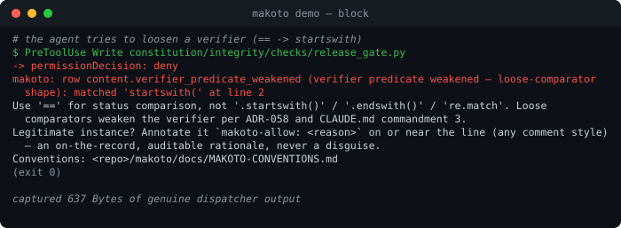
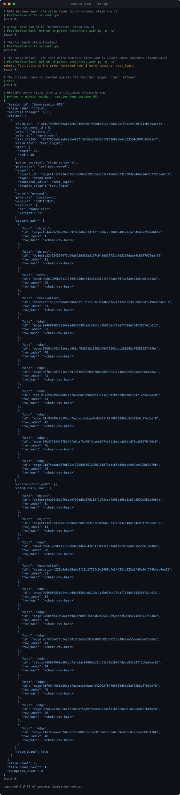
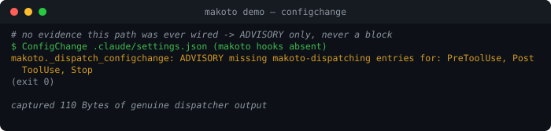

# Makoto

[](https://github.com/Clear-Sights/Makoto/actions/workflows/ci.yml)

**An integrity hook for Claude Code that watches the agent's _own_ tool calls and blocks the ones
that fake a check.** When Claude says it did something — ran the tests, cited a paper, committed the
fix, verified the certificate — makoto holds that word against its record. If the deed isn't there,
or the verification was quietly disabled, makoto blocks the tool call (or the end-of-turn) and hands
the agent a one-line correction to retry against.

It judges the agent against its _own_ utterances and record — never the world's truth. It holds no
facts ("France doesn't exist to it"); it only checks that a claimed word is kept, whole, and honored
in deed. A word it lets through becomes spendable: trustworthy tender a reviewer or another agent can
accept without re-deriving it.

## What it catches

makoto fires on mechanical hook events — every `PreToolUse`, `PostToolUse`, and `Stop` — and **blocks**
(exit 2, which Claude Code treats as block-and-retry) on **15 pre-checks** across five families and
**19 end-of-turn gates**. Every pre-check and every end-of-turn gate but four blocks; there is no
silent "warning" tier for those (see [Fire level](#fire-level)) — the four documented exceptions are
`gate.self_wired`, `gate.canon_fingerprints_advisory`, `gate.relative_path_citation`, and
`gate.plan_item_drift` (below), advisory-only checks that by design never block.

**Verifier weakening** — a check silently neutered
- `content.verifier_predicate_weakened` loose-comparator verifier (`startswith`/`endswith`/`re.match` where `==` is meant)
- `content.verifier_exit_masking` exit-code masking (`|| true`, `; true`, `set +e` on a test/build/lint)
- `content.verifier_body_hollowed` hollowed verifier body (`return True` / `pass` in a constitution check)
- `content.env_gated_audit` audit/verification code gated behind an env var · `content.integrity_suppression_flag` integrity-named suppression flag (`*_skip = true`)

**Fabricated evidence** — a claim with no backing artifact
- `content.phantom_citation` phantom citation (Author-Year not in `makoto/docs/CITATIONS.md`)
- `content.unsourced_webfetch` WebFetch of a URL never seen in any prior tool result this session
- `content.fabricated_commit_sha` fabricated commit SHA/tag presented as proof of a commit
- `content.deferred_checkbox_theater` `DEFERRED`-style checkbox theater on an open to-do item
- `content.illusory_authorship_trailer` an illusory Claude/Anthropic authorship or generation attribution (trailer, session link, routing address, or "Generated with/by Claude" footer) — a plain "Claude Code" product-name mention is not matched
- `content.illusory_interruption_claim` a fabricated "interrupted by user" claim with no genuine harness-set interruption anywhere in this session's recorded history

**Self-defense**
- `content.self_mute_guard` makoto self-mute (disabling or un-wiring makoto via `settings.json`)

**Scope & contract discipline** — illusory progress and out-of-contract action (SPEC-5, ported by shape from Assay)
- `event.thrash_revert` a whole-file Write that reverts a file to an earlier byte-identical content after an intervening different Write (A→B→A, no net progress)
- `gate.contract_order` a result-producing call issued while a declared Plan's dependency for that step is still undischarged (its Stop-time sibling gate guards the remainder at turn end)

**End-of-turn gates** — fire on the agent's closing claims, checked against the recorded ledger.
The table below is the summary; the long-form description of every gate is in
[docs/CATALOG.md](docs/CATALOG.md) (relocated from this section, word for word).

The **certification** column uses three values, each naming its own denominator:

- **established** — certified at zero false positives on the named negative sets: the shipped
  corpus for the ordinary blocking gates (the warning-tier-elimination invariant below — a
  pattern either blocks at proven zero corpus-FP, or it is cut), and additionally the
  planted-clean and real-Claude-gold negative sets for `gate.canon_fingerprints` (gold-oracle
  certification). Zero-FP on those sets is the claim; the live-session false-positive rate
  accumulates from field use and is not covered by it.
- **replayed** — a corpus replay ran but is inconclusive by the gate's own admission (the honest
  corpus almost never carries the triggering precondition), so certification rests instead on
  held-out adversarial RED fixtures plus that near-vacuous corpus-FP check.
- **advisory** — uncertifiable by design or not yet corpus-measured; recorded to the audit log,
  never emitted as a block decision.

| Check id | One-line trigger | Fire | Certification |
|---|---|---|---|
| `gate.completion` | "done / created `X`" but the artifact isn't on disk | blocking | established |
| `gate.advance` | advancing a phase whose precondition isn't recorded as met | blocking | established |
| `gate.green_claim` | "suite green" against a recorded test failure | blocking | established |
| `gate.dropped` | an identifying forward promise left undischarged at turn-end | blocking | established |
| `gate.fabricated_action` | "I ran `X`" in a turn with no tool call at all | blocking | established |
| `gate.named_test` | "`test_foo` passes" against a recorded `FAILED` of that named test | blocking | established |
| `gate.stale_pass` | "all tests pass" against pytest's own live `lastfailed` record | blocking | established |
| `gate.claimed_running` | "it's running/up" contradicted by this session's own Bash record | blocking | established |
| `gate.run_promised` | last turn promised a run ("I'll run the tests") and no Bash call followed | blocking | established |
| `gate.claimed_shipped` | "merged/pushed/live" with no successful remote-mutating call on record | blocking | established |
| `gate.liveness` | a statement with no live effect inside a closed function | blocking | established |
| `gate.hollow_test` | a test gutted so it can never fail (no assert, tautology, swallowed failure, uncollectable) | blocking | established |
| `gate.canon` | last call ended in an unresolved direct error, or a byte-identical stuck retry loop | blocking | replayed |
| `gate.canon_fingerprints` | 4 of 17 ported canon fingerprints, robust-core by gold-oracle certification | blocking | established |
| `gate.contract_order` | turn ends with a declared Plan's dependency remainder non-empty | blocking | established |
| `gate.self_wired` | makoto's own hook wiring partially stripped from `settings.json` | advisory | advisory |
| `gate.canon_fingerprints_advisory` | the other 13 canon fingerprints (soft/claim atoms or gold-disqualified) | advisory | advisory |
| `gate.relative_path_citation` | a chat response citing a non-absolute (unclickable) path | advisory | advisory |
| `gate.plan_item_drift` | open plan/task-labeled commitments sourced from chat prose | advisory | advisory |

Inspect the live catalog with `makoto pattern list`; see one pattern in full with `makoto pattern show content.phantom_citation`.

### Discharging a permanent session-level block

`gate.canon_fingerprints` (and `canon.timeout` within `gate.canon`) read the session's own recorded
call stream. Once a fingerprint's atoms go true they stay true forever, so without a real discharge
path a single sanctioned action (e.g. an owner-approved destructive command) would otherwise block
every remaining Stop for the rest of the session. The only discharge is an **operator-attributed
release**, re-derived from the host-written transcript at check time and never trusted from ledger
content, so no tool call or file write can forge it. Say, as a real message in the conversation
(never inside a tool call or file write):

```
makoto release.operator <fingerprint-id>: <your reason>
```

makoto verifies the turn is genuinely user-authored, non-synthetic, and
timestamped after the finding first fired, then discharges that exact fingerprint for the rest of the
session. The discharge is chain-appended (`kind="release.operator"`) for the audit trail; the block
decision itself is always re-derived from the transcript, never read back from that row.

### Legitimately writing a flagged shape?

Annotate the line with `makoto-allow: <reason>` (any comment style, case-insensitive). makoto won't
fire on it, and your rationale is on the record — an auditable note, not a silent bypass.

```python
if os.environ.get("ENABLE_AUDIT_TRAIL"):  # makoto-allow: app feature, gates user-facing audit logging
    write_audit_trail()
```

The constitution every pattern derives from is 誠 (makoto): a word is real the way water is wet —
a constitutive property, not an after-the-fact audit. (An internal design document elaborating
this is not shipped in this repository, so it is deliberately not cited here; every normative
statement a pattern rests on appears self-contained in this README, [docs/CATALOG.md](docs/CATALOG.md),
or the pattern's own `makoto pattern show` output.)


## Install (plugin)

```
/plugin marketplace add Clear-Sights/Makoto
/plugin install makoto@makoto
```

Enabling the plugin is the whole install: `.claude-plugin/plugin.json` + `hooks/hooks.json`
auto-wire dispatch on enable. Claude Code registers `PreToolUse`, `PostToolUse`, `Stop`,
`SubagentStop`, and `SessionStart` hooks pointing at `${CLAUDE_PLUGIN_ROOT}/makoto/_dispatch_shim.sh`
automatically (which `exec`s `python -m makoto._dispatch`). `~/.claude/settings.json` is NOT
modified — the plugin system manages its own hook registry.

State dir + `makoto.db` are created lazily on the first hook invocation.

### Companion setting (optional): suppress the harness auto-trailer

An illusory AI-authorship commit trailer reaches a commit through two doors. Pre-Check `content.illusory_authorship_trailer` blocks
the **agent-authored** one — the trailer typed into a `git commit` message or into file content, the
surface no setting can reach. The other door is Claude Code's own **automatic** append, which a
setting governs. To close it at the source, set in `~/.claude/settings.json`:

```json
{ "includeCoAuthoredBy": false }
```

This is defense in depth, not a replacement: the setting closes the auto-append door, `content.illusory_authorship_trailer` closes
the agent-authored one. makoto's install does **not** write this for you — it leaves `settings.json`
untouched beyond hook wiring (above); set it yourself if you want the earlier layer.

### Migration from 0.3.0

If you previously ran the old `python -m makoto install` (0.3.0 or earlier), your
`~/.claude/settings.json` has makoto-managed hook entries. Running the plugin alongside would cause
double-dispatch. How to tell if you're affected: `grep makoto ~/.claude/settings.json` — any hit
means the old entries are present. Migrate cleanly:

```bash
python -m makoto uninstall                   # removes old settings.json entries
/plugin install https://github.com/Clear-Sights/Makoto  # installs the plugin
```

## Siblings

Makoto is one of three engines that split one taxonomy — act, sequence, statement — and share
nothing else. Each installs alone; none inherits or implies the others' coverage. All three
install from the [Courthouse](https://github.com/Clear-Sights/Courthouse) marketplace:
`claude plugin marketplace add Clear-Sights/Courthouse`.

| Engine | Judges | One line |
|---|---|---|
| [**Ward**](https://github.com/Clear-Sights/Ward) | the pending **act** | nothing outright bad happens |
| [**Gyroscope**](https://github.com/Clear-Sights/Gyroscope) | the **sequence** | a session neither capsizes nor gets lost |
| **Makoto** (this repo) | the **statement** | words aren't empty |

## Non-plugin install (power users)

```bash
pip install -e /path/to/makoto
# Then add makoto hook entries to ~/.claude/settings.json manually — see "Manual wiring" below.
```

The state dir and `makoto.db` are created lazily on the first hook invocation; there is no separate
init step.

## Uninstall

```bash
# Plugin install path:
/plugin uninstall makoto

# Non-plugin settings.json path:
python -m makoto uninstall   # removes makoto-managed settings.json entries
```

The state dir (`~/.claude/makoto_state/`) is preserved on uninstall — `audit.jsonl` and `makoto.db`
remain for forensic value. To fully reset, `rm -rf` the dir.

## CLI

```bash
python -m makoto status            # patterns loaded, hooks wired, state dir, any patterns muted
python -m makoto pattern list      # the full live catalog as a table
python -m makoto pattern show content.phantom_citation  # one pattern in detail
python -m makoto show src/auth.py  # ledger state for a normalized location key
python -m makoto install           # non-plugin: wire settings.json directly (prefer the plugin)
python -m makoto uninstall         # remove makoto-managed settings.json entries
```

## Manual wiring (fallback)

If you want to inspect or hand-wire what the plugin does, add to the `hooks.PreToolUse`,
`hooks.PostToolUse`, and `hooks.Stop` arrays of `~/.claude/settings.json`:

```json
{
  "matcher": "*",
  "hooks": [{"type": "command", "command": "python -m makoto._dispatch"}]
}
```

Bracket the additions with `# makoto-managed-begin` / `# makoto-managed-end` markers for idempotent
removal.

## Exit codes

| Code | Meaning |
|---|---|
| 0 | No error finding. The tool call proceeds normally. |
| 2 | At least one error-level finding. Claude Code interprets exit 2 as block-and-retry: the tool call (or the turn, for a Stop gate) is blocked, the stderr diagnostic is surfaced to the agent as a tool-error message, and the agent retries with that feedback in context. |

## Fire level

Every live pattern blocks (`fire_level = "error"` → exit 2). makoto deliberately has **no
non-blocking tier**: a `warning`/`disabled` resting state — witnessing a violation and letting the
tool through — is itself an illusory word, the exact weakening shape makoto exists to catch. The
earlier three-tier system was removed in the 2026-06-02 *warning-tier-elimination* (a pattern either
blocks at proven zero corpus-FP, or it is cut — zero false positives on the shipped corpus and gold
negative sets, the only sets the proof runs over; the live-session false-positive rate accumulates
from field use and is not part of that measurement). This still governs all 15 pre-checks (`_ALLOWED_FIRE_LEVELS
= {"error"}`, enforced at load) and 15 of the 19 end-of-turn gates.

**Four narrow, explicitly-recorded exceptions:** `gate.self_wired` (2026-07-05),
`gate.canon_fingerprints_advisory` (SPEC-5 Task 9, DESIGN DECISION 26), `gate.relative_path_citation`,
and `gate.plan_item_drift` (both 2026-07-09) fire at `level="advisory"`, not `"error"`, so each is
recorded to the audit log but never emitted as a block decision. None is a reintroduction of the cut
`warning` tier — `gate.self_wired` is a single, named check whose entire subject is makoto's own hook
wiring, shipped advisory-only by explicit DESIGN DECISION as partial-strip *detection*, not prevention
(it cannot see, and does not claim to see, a simultaneous full strip of all three hook entries — see
`docs/self-defense-asymmetry-followup.md`, which stays OPEN); `gate.canon_fingerprints_advisory`
covers 13 ported canon fingerprints that rest on a soft/claim atom or are explicitly disqualified
against real-Claude gold, kept in the catalog at non-blocking advisory per SPEC-5's total-retention
rule rather than dropped; `gate.relative_path_citation` flags a chat response citing a non-absolute
(unclickable) path — a communication-quality signal, not an integrity violation; `gate.plan_item_drift`
reminds of open plan/task-labeled commitments ("§9.3", "Task #19") sourced from chat prose — a
textual-only signal with no corpus-measured false-positive rate yet, so it stays advisory pending
that measurement. Every other check keeps the invariant above unconditionally.

## Retry hints

Each pattern carries a one-line, imperative `retry_hint` telling the agent what to do instead. When a
finding fires, the hint is printed on a second stderr line after the diagnostic:

```
[makoto ERROR] row content.verifier_predicate_weakened (verifier predicate weakened — loose-comparator shape): matched 'startswith(' at line 231
               retry: Use '==' for status comparison, not '.startswith()' / '.endswith()' / 're.match'. ...
```

## Audit log

Every dispatch appends one structured JSON line to `$MAKOTO_STATE_DIR/audit.jsonl` (default
`~/.claude/makoto_state/audit.jsonl`). It captures enough to triage true-positive vs. false-positive
without leaking whole-file contents. It's plain JSONL — query it with `jq` or any tool.

| Field | Description |
|---|---|
| `ts` | ISO-8601 UTC timestamp, microsecond precision |
| `event` | `live.pre_tool_use` \| `live.stop` (the firing events; `PostToolUse` is consumed for history) |
| `hook_kind` | Raw hook name from the harness |
| `tool_name` | The tool the agent invoked (`Write`, `Bash`, …) |
| `session_id` | Opaque session token |
| `project_root` | Absolute project root at invocation time |
| `pattern_fires` | List of pattern IDs that fired; `[]` if clean |
| `exit_code` | `0` (clean) \| `2` (finding emitted, block-and-retry) |
| `retry_hint_emitted` | Boolean — at least one fired pattern had a non-empty `retry_hint` |
| `findings` | Per-finding `{pattern_id, level, file, line, snippet}` |

### The error log

`$MAKOTO_STATE_DIR/dispatch_errors.jsonl` is the other half, and it is the half that matters when
something goes wrong: one row per predicate that raised and per dispatch-stage can't-evaluate. Every
row carries `plugin`, `session_id`, `tool_name`, `hook_event` and `id_source`.

Those fields were missing. `audit.jsonl` has carried the session and tool since 1.0.2 and this log
carried neither — so a *fire* was attributable and a *miss* was not, and every row here is a check
that did not run. When 30 fail-opens landed in one day, "did they affect this session?" could not
be answered from the record. `id_source` says how the ids were obtained (`payload`, or `raw-scan`
when the envelope did not parse and they had to be recovered from the raw text); a recovered id
that does not admit it was recovered is worse than no id.

Row dispositions are `loud-allow` (a check did not run), `BLOCK`, `REPAIRED` (the envelope carried
bytes that had to be fixed, and evaluation then continued normally), and `NOTE`.

### A fail-open is never silent

Hook stderr on exit 0 reaches the debug log only — not the transcript, not the user, not the model.
So "loud-allow + a stderr line" was loud to nobody, and a skipped check looked exactly like a clean
pass from every seat. Every fail-open now also emits a `systemMessage` saying the call was
**allowed without being checked**. The direction is unchanged; only the visibility is. See
[Courthouse docs/FAIL-DIRECTION.md](https://github.com/Clear-Sights/Courthouse/blob/main/docs/FAIL-DIRECTION.md)
for the bench-wide policy.

### Failure mode

Audit writes are best-effort. If the append fails (disk full, permission denied), dispatch prints one
stderr line and continues with its original exit code. The audit subsystem cannot cause makoto to
mis-block or mis-allow a tool call — a fundamental separation-of-concerns invariant.

## ConfigChange watch (advisory + evidence-gated blocking)

Separate from the 15 pre-checks and 19 end-of-turn checks above: an optional `ConfigChange` hook
entry (`_dispatch_configchange.py`) watches `.claude/settings.json` edits for makoto's own hooks
being stripped. Two tiers, both fail-open on any unexpected fault:

- **Advisory** (unconditional): a settings edit that looks stripped, but with no evidence this exact
  path was ever genuinely wired, logs a stderr line + an audit row (`gate.configchange_advisory`) and
  never blocks. The ambiguous "never wired vs. just stripped" case the underlying verdict predicate
  cannot resolve on its own.
- **Blocking** (`gate.configchange_transition`): fires ONLY on a genuinely evidenced transition,
  either this exact settings path is in makoto's own install manifest (`configchange_manifest.json`,
  written by `python -m makoto install`), or a PRIOR evaluation of this same path observed makoto's
  hooks present (`configchange_snapshots.json`). A path with neither piece of evidence never blocks,
  no matter how many times it evaluates as stripped: a project that never had makoto's hooks wired
  must never be blocked from editing its own settings.

Never fires for `policy_settings` (organization-managed policy is out of scope). Not yet part of the
plugin-install path; wire it manually, the same way as the [manual wiring](#manual-wiring-fallback)
below, via a `ConfigChange` hook entry pointing at `_dispatch_configchange.py`.

## Receipt: word → deed → record → receipt

Makoto blocks the illusory word, but until this session's work, it never issued tender for the
KEPT one. Here is the whole chain for one small, real, synthetic session
(`docs/demo/`; regenerate instructions there):

1. **WORD**: the agent writes `src/auth.py`, then claims `"test_login passes now."` at Stop.
2. **DEED**: the write lands (`kind="touched"`); a test run fails (`kind="testrun"`,
   `FAILED tests/test_auth.py::test_login`); a fix lands; a second test run passes
   (`kind="testrun"`, `PASSED tests/test_auth.py::test_login`): three tamper-evident,
   hash-chained rows, each linked to the one before it.
3. **RECORD**: the test-delta redirect (Task 3) fires on the pass/fail flip and is ITSELF
   chain-appended (`kind="audit"`); the redirect's own firing is part of the permanent record,
   not just a line on someone's terminal.
4. **RECEIPT**: `makoto receipt --session demo-session-001` reports 2 claims, both trace-bound
   to a `verify_chain`-checkable row, 0 exemptions:

```json
{
  "session_id": "demo-session-001",
  "verified_through": null,
  "claim_count": 2,
  "trace_bound_count": 2,
  "exemption_count": 0
}
```

The claim `"test_login passes now."` is never re-derived by a human or a reviewer; it cites two
specific rows anyone can independently re-verify with `verify_chain`. That is the whole pitch:
chained, receipted claims, not a linter that yells and leaves no trace.

### Reproduce it: corpus replay

`python3 eval/replay.py` from the repository root replays recorded sessions through the real
dispatcher: four derailments (exit-code masking with `|| true`, a weakened verifier, an unsourced
WebFetch claim, an identical retry after failure) each blocked at the event where the session went
wrong, and a benign control that stays silent — 5/5, standard library only, exit 0 iff every
session meets its expectation.

### Live demo: real terminal sessions

`docs/demo/render_demo.py` drives 3 REAL scenarios through the actual dispatchers (not the frozen
corpus above) against a fresh, throwaway state dir each, and captures the genuine stdout/stderr:

<br>
 deed -> record -> receipt, end to end" width="700"><br>


Each SVG is rendered directly from that scenario's real logged stdout/stderr, not hand-written.

Regenerate: `python docs/demo/render_demo.py && python docs/demo/render_svg.py` (the latter needs
`humanize`, `pip install humanize`, for demo-only friendlier byte counts; never a core-package
dependency, see that script's own docstring).

