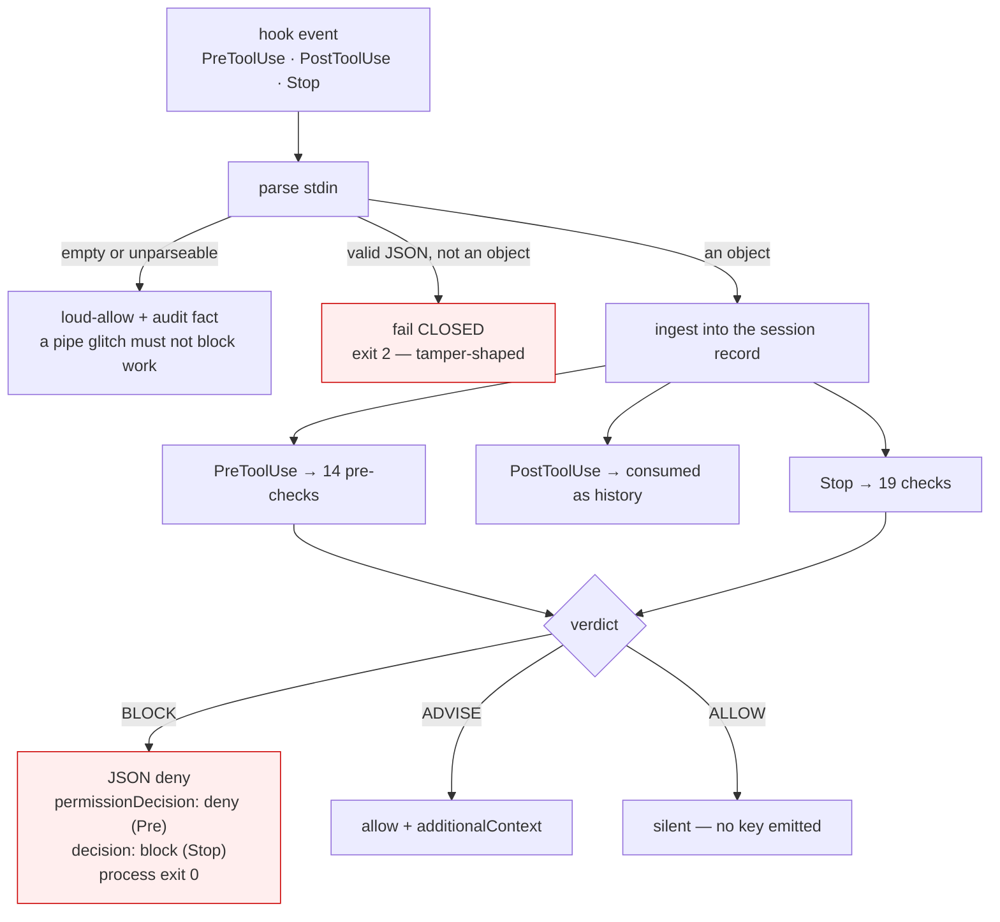

# Makoto

[](https://github.com/Clear-Sights/Makoto/actions/workflows/ci.yml)

**When the agent says it did something, is the deed in the record?**

Makoto is an integrity hook for Claude Code that watches the agent's *own* tool calls. When Claude
says it ran the tests, cited a paper, pushed the commit, verified the certificate — makoto holds
that word against the session's recorded deeds. If the deed isn't there, or the verification was
quietly disabled, the call is denied and the agent gets a one-line correction to retry against.

It judges the agent against its own utterances and record, never against the world's truth. It
holds no facts — France does not exist to it. It checks only that a claimed word was kept.

Makoto is the sincerity pillar alongside [Ward](https://github.com/Clear-Sights/Ward) (is this
action dangerous, regardless of what is claimed) and
[Detent](https://github.com/Clear-Sights/Detent) (is this acquisition deterministic). A weakened
TLS check is Ward's question and stays dangerous however honest the agent was; a fabricated test
result is makoto's and stays dishonest however safe the write is.

## How it works


```mermaid
flowchart TD
    E["hook event<br/>PreToolUse · PostToolUse · Stop"] --> P["parse stdin"]
    P -->|"empty or unparseable"| LA["loud-allow + audit fact<br/>a pipe glitch must not block work"]
    P -->|"valid JSON, not an object"| FC["fail CLOSED<br/>exit 2 — tamper-shaped"]
    P -->|"an object"| I["ingest into the session record"]
    I --> PRE["PreToolUse → 14 pre-checks"]
    I --> POST["PostToolUse → consumed as history"]
    I --> STOP["Stop → 19 checks"]
    PRE --> W{"verdict"}
    STOP --> W
    W -->|BLOCK| DENY["JSON deny<br/>permissionDecision: deny (Pre)<br/>decision: block (Stop)<br/>process exit 0"]
    W -->|ADVISE| ADV["allow + additionalContext"]
    W -->|ALLOW| SIL["silent — no key emitted"]
    style FC fill:#fee,stroke:#c00
    style DENY fill:#fee,stroke:#c00
```

**A block is a JSON decision, not an exit code.** The dispatcher returns 0 on every normal path and
communicates the block in its stdout envelope — `permissionDecision: "deny"` for PreToolUse,
`decision: "block"` for Stop. Process exit 2 is reserved for exactly one case: a payload that is
valid JSON but not an object, which a truncated pipe cannot produce and which is therefore treated
as tamper-shaped and failed closed.

The two left-hand branches are the fail-open half, and they are deliberate. Empty stdin and
unparseable stdin both allow, because a truncated pipe must never block the agent's work — but they
record *different* reasons, because no bytes at all is a wiring fault that will recur on every
event, while bytes that did not parse is a transient cut mid-write.

## Run it

```console
$ python3 -m pytest -q
1540 passed, 5 skipped, 1 xfailed in 38.60s
```

The repository drives three real scenarios end-to-end through the actual dispatchers against a
fresh throwaway state dir, and captures the genuine stdout. Here is a real block, from
`docs/demo/logs/block.json` — the agent tries to loosen a verifier from `==` to `startswith`:

```console
$ echo '<PreToolUse Write constitution/integrity/checks/release_gate.py>' | python3 makoto/_dispatch.py
{"hookSpecificOutput": {"hookEventName": "PreToolUse", "permissionDecision": "deny",
 "permissionDecisionReason": "makoto: row content.verifier_predicate_weakened (verifier predicate
 weakened — loose-comparator shape): matched 'startswith(' at line 2\nUse '==' for status
 comparison, not '.startswith()' / '.endswith()' / 're.match'. Loose comparators weaken the
 verifier per ADR-058 and CLAUDE.md commandment 3.\nLegitimate instance? Annotate it
 `makoto-allow: <reason>` on or near the line (any comment style) — an on-the-record, auditable
 rationale, never a disguise."}}
$ echo $?
0
```

Note the exit code in that transcript: **0**, with the denial carried in the JSON. Note also the
escape hatch — `makoto-allow: <reason>` is an on-the-record annotation, not a silent suppression.

Inspect the live catalog rather than trusting this page:

```console
$ python3 -m makoto pattern list
$ python3 -m makoto pattern show content.phantom_citation
$ python3 -m makoto status          # patterns_count, hooks_wired, state_dir
```

`status` sources its count from the same loader `pattern list` uses. It used to source it from the
Pre edge alone and report 15 of 35, so two commands in one CLI answered the same question with
different numbers.

## The catalog

Counts here come from `load_checks()`, not from prose: **14 pre-checks** on the Pre edge and 19
checks on the Stop edge, 33 rows over **32 distinct ids** — `gate.contract_order` registers on both
edges and is one pattern, not two. The Pre edge has no advisory tier: a pre-check either denies or
is silent.

| edge | family | count |
|---|---|---|
| Pre | `content.*` — verifier weakening, fabricated evidence, self-defense | 11 |
| Pre | `event.*` — `event.identical_retry`, `event.thrash_revert` | 2 |
| Pre | `gate.contract_order` (its PreToolUse sibling guard) | 1 |
| Stop | `gate.*` — checks on the agent's closing claims | 19 |

Those 19 are not one tier. A Stop check is blocking-**eligible** only when `may_block` is true.
That eligible set is the **17 end-of-turn gates**, and it splits again
by posture:

- **14 block.** `gate.advance`, `gate.canon`, `gate.claimed_running`,
  `gate.claimed_shipped`, `gate.completion`, `gate.contract_order`, `gate.dropped`,
  `gate.fabricated_action`, `gate.green_claim`, `gate.hollow_test`, `gate.liveness`,
  `gate.named_test`, `gate.run_promised`, `gate.stale_pass`.
- **3 are advisory by posture** — decision-eligible, deliberately set not to block:
  `gate.self_wired`, `gate.relative_path_citation`, `gate.plan_item_drift`.

The **other 2 Stop-edge checks are structurally excluded** from blocking: `may_block=False`, so
`gate.stale_establisher` and `gate.catalog_completeness` cannot reach a block decision at all,
whatever their posture. They ship, they run, and they record. Naming them is the honest addition
here — the stated Stop-check count is 19 because it counts every Stop-edge check, while the
end-of-turn gate count is 17 because it excludes these two.

`tests/test_readme_materiality.py` binds both stated counts and every live gate id back to the
loader, so this section cannot drift from the code without a test going red. It did exactly that
while this rewrite was being drafted.

`makoto pattern show <id>` prints any single check in full — its edge, fire level, trigger tokens
and rationale. That is the catalog; this page deliberately does not duplicate it, because a
hand-maintained copy is what let three shipped checks go undocumented here for as long as they did.

## Planted ground truth

Checks are measured against planted faults with matched negative controls, never against
themselves. `tests/corpora/` holds **4 TP/TN pairs** — 8 files — where each true-positive file
carries the finding it must produce and its true-negative twin carries the near-miss that must stay
silent:

```yaml
# TP_phantomCitation_phantom_citation.md
expected_finding: {row_id: "content.phantom_citation", fire_level: "error",
                   reason_contains: "Phantom 2099"}
expected_pass: false
---
As shown by Phantom 2099, the result holds.

# TN_phantomCitation_valid_citation.md
expected_finding: null
expected_pass: true
---
As shown by Knight-Leveson 1986, the result holds.
```

The TN half is the half that keeps makoto usable: a check that fires on an honest citation gets
turned off, and a check that is off protects nothing.

Chain integrity is pinned by content vectors — `tests/vectors/chain_v1/intact.jsonl`
(sha256 `50a48daf3fc7e11e`) and its `tampered.jsonl` twin (`7fad578b1eec0bfc`) — and the wiring
manifests are pinned too:

| artifact | sha256 (first 16) |
|---|---|
| `.claude-plugin/plugin.json` | `2be6899a6140ecec` |
| `.claude-plugin/marketplace.json` | `7a092e1c0a50550f` |
| `hooks/hooks.json` | `1bee8f42a19436a5` |

## What it does not do

- **It does not authenticate tool output.** A genuine `PostToolUse` envelope proves that the host
  recorded those bytes; it does not prove which process produced them or that they are an honest
  result. An agent can invoke a recognized runner without running the suite and print a fabricated
  passing summary into the same stdout shape. Makoto cannot distinguish that text from
  runner-produced output and may certify it. It checks envelope and command provenance, not output
  origin.
- **It does not know whether a claim is true of the world.** Only whether it is supported by this
  session's own record. An agent that honestly reports a fact makoto has no deed for is treated the
  same as one that invented it — makoto's answer is "not evidenced here", never "false".
- **It does not judge danger.** A write that is perfectly honest and perfectly catastrophic passes
  makoto untouched. That is Ward's question, and merging them would make both answers softer.
- **It does not claim a measured false-positive rate on your sessions.** The TP/TN corpora are
  regression fixtures, not an independent survey. Posture alone does not imply that a check has a
  corpus-measured false-positive rate.
- **A clean corpus replay is not a certification.** For `gate.canon`, the honest corpus almost
  never carries the triggering precondition at all, so zero fires there is inconclusive rather than
  evidence. The blocking claim rests on held-out adversarial RED fixtures instead.
- **`gate.self_wired` has a documented blind spot it cannot close.** It detects a *partial* strip of
  makoto's own hook wiring. A single edit removing all three entries at once disables the check in
  the same instant it would have fired, because Claude Code reloads hook config live. It provides
  zero coverage against the full-strip case, and says so rather than implying protection.
- **It does not block a project that never wired it.** `gate.configchange_transition` fires only on
  an evidenced transition — this settings path is in makoto's own install manifest, or a prior
  evaluation observed makoto's hooks present. Absent both, it never blocks, however stripped the
  file looks.

## Audit log

Every dispatch appends one JSON line to `$MAKOTO_STATE_DIR/audit.jsonl` (default
`~/.claude/makoto_state/audit.jsonl`), carrying `ts`, `event`, `tool_name`, `session_id`,
`project_root`, `pattern_fires`, `exit_code`, `retry_hint_emitted`, and per-finding
`{pattern_id, level, file, line, snippet}`. Enough to triage true- from false-positives without
copying whole files.

Audit writes are best-effort. If the append fails, dispatch prints one stderr line and continues
with its original decision — the audit subsystem cannot cause makoto to mis-block or mis-allow.

## Layout

`makoto/_dispatch.py` is the hook entry point and `makoto/verdict/wire.py` renders the decision.
`makoto/checks/` holds the predicates, one per file. `makoto/record/` is the hash-chained session
ledger, `makoto/session/` the claim extractors, `makoto/substrate/` the shared primitives. Install
with `python -m makoto install`; the packaged plugin manifests are under `.claude-plugin/`.

[docs/SPIRIT.md](docs/SPIRIT.md) is the standard the checks are written against.
[makoto/docs/MAKOTO-CONVENTIONS.md](makoto/docs/MAKOTO-CONVENTIONS.md) is what a retry hint points
an agent at, [makoto/docs/CITATIONS.md](makoto/docs/CITATIONS.md) is the citation allowlist
`content.phantom_citation` reads, and
[docs/self-defense-asymmetry-followup.md](docs/self-defense-asymmetry-followup.md) records the
`gate.self_wired` blind spot in full.

Standard library only — nothing to install beyond Python itself.
